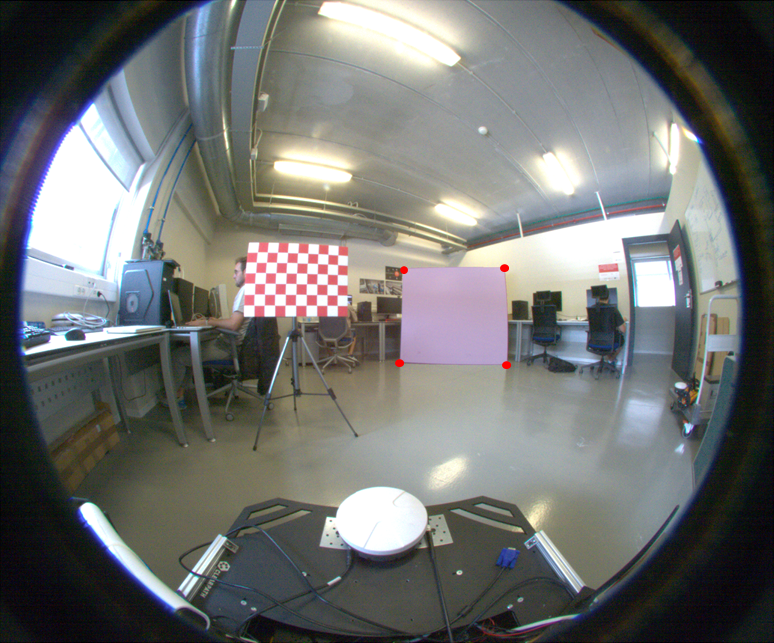

# **fisheye_lidar_calibration**

**_fisheye_lidar_calibration_** is an open source implementation of a target-based method for LiDAR and fisheye camera calibration. It finds the rotation and translation between fisheye camera and LiDAR and use them to project LiDAR data onto the corresponding fisheye image.


<!-- <p float="left">
  
   
</p> -->

## Installation

Git clone the repository:

```sh
git clone https://github.com/ARVCUMH/fisheye_lidar_calibration
```

Install requirements:

```sh
cd fisheye_lidar_calibration/
pip install -r requirements.txt
```

The code requires `python>=3.8`, as well as `pytorch>=1.7` and `torchvision>=0.8`.

Install *Pytorch* version from the [Pytorch website](https://pytorch.org/get-started/previous-versions/) and follow the instructions.

### Segment Anything

To detect plane corners from image data, this callibration tool uses [Segment Anything](https://github.com/facebookresearch/segment-anything/tree/main).

  

Git clone the Segment Anything **inside your project folder**, then copy the folder *segment_anything* inside the project folder and remove the rest.

```sh
git clone https://github.com/facebookresearch/segment-anything.git
cd segment-anything/
cp -r segment_anything/ ..
cd ..
rm -r segment-anything/
```

#### SAM Model

Segment Anything model is needed to perform a plane segmentation. You can download the checkpoint for the corresponding model type from these links:

- **`default` or `vit_h`: [ViT-H SAM model.](https://dl.fbaipublicfiles.com/segment_anything/sam_vit_h_4b8939.pth)**
- `vit_l`: [ViT-L SAM model.](https://dl.fbaipublicfiles.com/segment_anything/sam_vit_l_0b3195.pth)
- `vit_b`: [ViT-B SAM model.](https://dl.fbaipublicfiles.com/segment_anything/sam_vit_b_01ec64.pth)

Make sure the downloaded model is inside your project folder (fisheye_lidar_calibration).

## Configuration

### Calibration file

For using this calibration method, the existence of a calibration file is completely crucial. This calibration file contains the fisheye camera parameters needed for the lidar point projection. The format of this *.txt* file must be as follows:

```
#polynomial coefficients for the DIRECT mapping function (ocam_model.ss in MATLAB). These are used by cam2world

5 -7.121702e+02 0.000000e+00 4.812818e-04 -1.435090e-07 1.699419e-10 

#polynomial coefficients for the inverse mapping function (ocam_model.invpol in MATLAB). These are used by world2cam

12 1147.898677 733.075584 11.510652 77.773746 70.045334 -1.172804 7.788372 31.755008 7.286971 -11.630820 -7.017475 -1.154235 

#center: "row" and "column", starting from 0 (C convention)

1073.715833 1285.434616

#affine parameters "c", "d", "e"

0.999946 -0.001141 -0.001446

#image size: "height" and "width"

2160 2600
```

This file is generated by the Davide Scaramuzza's [toolbox](https://sites.google.com/site/scarabotix/ocamcalib-omnidirectional-camera-calibration-toolbox-for-matlab), implemented in MATLAB. Follow the instructions to generate the calibration file.

### Configuration Parameters

A config.yaml file is used to adjust the parameters to the experiment data.

#### Experiment paths

```
# Experiment data
images_path: "demo/images_frontal"  #"demo/images"
spherical: False # True if you are using spherical images, False if you are using fisheye images
pointclouds_path: "demo/pointclouds_frontal"  #"demo/pointclouds"

# Calibration data
calibration_file: "demo/calib_results_frontal.txt"
```

#### Plane(s) dimensions

Measure the plane(s) used in the experiments. Add or delete to adjust the list to the number of planes used.

Demo values: [[[1.89, 1.706], [0.594, 0.412]]]. Use python list format.

`planes_sizes`: Width and height of planes in meters


#### Experiment parameters

Set horizontal and vertical resolution of the LiDAR in degrees. Turn `show_lidar_onto_image` parameter to 1 to visualize the LiDAR onto the fisheye image after calculating the transform of every pair of image and pointcloud.

Demo values:
```
lidar_vertical_resolution: 0.3515625
lidar_horizontal_resolution: 0.3515625
```

`show_lidar_onto_image`: 0: no, 1: on equirectangular image, 2: on fisheye image

#### LiDAR parameters

- `reflectivity_threshold`: Reflectance threshold for filtering points. Between 0 and 1. 0 for no filtering.
For demo: 0.15
- `radius_kdtree`: Radius for kdtree search. Distance for finding new neighbors in plane points.
For demo: [0.06, 0.022]
- `rotations`: Number of different equal plane rotations in degrees between 0º and 90º to minimize plane area.
Default: 720
- `show_lidar_plane`: Show lidar detected plane.

<p align="center">
  
</p>

#### Image parameters

- `simulated`: "False". Keep it false since simulation is not going to be used.
- `corner_detection_mode`: "automatic" or "manual". If "manual", you need to zoom in once and click corners manually.
- `selection_mode`: "box" for drawing a box around the plane to be detected or "points" to select as many points as wanted from the object plane.
- `model_path`: Path to the model. Default: "sam_vit_h_4b8939.pth".
- `model_type`: Model type: "vit_h", "vit_l" or "vit_b". Default: "vit_h".
- `device`: "cpu" or "cuda". Check Pytorch version for compatibility.

- `dilation`: Morphological dilation. Demo: "True".
- `kernel_size`: Kernel size for morphological dilation. Demo: 4. Adjust manually after visualizing mask segmentation.
- `contour_distance_threshold`: Threshold for filtering the closest contours points to the mask centroid. Between 0 and 1. Default: 0.85. For a very turned plane or close to the image boundaries, it is recommended to decrease the threshold to avoid losing corners.
- `ransac_iterations`: Number of RANSAC iterations for selecting corners which optimizes the distance between them. Demo: 120000

- `show_segmented_plane`: Show segmentated plane in the image

#### Save parameters

Name results folder and csv file where the rotation and translation data will be saved

```
save_results: True  # Save results from calibration (rotation and translation)
data_path: "corners/demo"  # Path to save pixel or corners values
data_file: "corners_frontal"  # Name of the data file

save_data: True  # Save corners data in a .csv file
save_path: "results"  # Path to save the results. The folder is created if it does not exist.
results_file: "demo_mean_frontal"  # Name of the results file
```

When the calibration is done, point clouds with image coordinates [x, y, z, (r), u, v] in .ply format can be saved after obtaining the results file. Add the paths were image and pointclouds are taken to carry out this process. Reflectivity (or any other feature) will be saved if the initial cloud contain it.

```
load_images_path: "demo/images"  # Path to load images
load_pointclouds_path: "demo/pointclouds"  # Path to load point clouds
```

It is strongly recommended to **READ THE COMMENTS FROM EACH PARAMETER**. Some of them depend on the adquired data configuration (image and LiDAR), so the default parameters may not work in some cases.

## Demo

A *demo* folder with experiment data is available to test with. It provides:
- images: folder with ten fisheye images
- pointclouds: folder with ten pointclouds in .ply format (they are saved with reflectivity data (x, y, z, r))
- calib_results.txt: file with the fisheye calibration parameters

## Instructions

### Obtain calibration

- Set a folder similar to the *demo* folder, with images and pointclouds acquired simultaneously and a calibration file as explained above. The repo supports *.pcd* and *.ply* formats for pointcloud. Point cloud shape is supposed to be (x, y, z) or (x, y, z, r) where r is taken as reflectivity, but can be any other feature. Images are loaded with *imread* function from matplotlib library, so any file type is supported.

- Change parameters from the config.yaml to adapt them to your experiment and preferencies.

- Run `corner_finder.py` and save the data in the *data_path* folder. If you want to save the data, set *save_data* to True.

- Run `LiDAR_camera_calibration_kabsch.py` or `LiDAR_camera_calibration_minimization.py`

- See the results. Mean rotation and traslation will be saved in a csv file in the *save_path* folder. If you want to save the results, set *save_results* to True.

### Save image data with point clouds

- Run `save_pointcloud_image.py`

## Citation

If you use **_fisheye_lidar_calibration_**, you can cite the paper using the following BibTeX entry.

```
```


